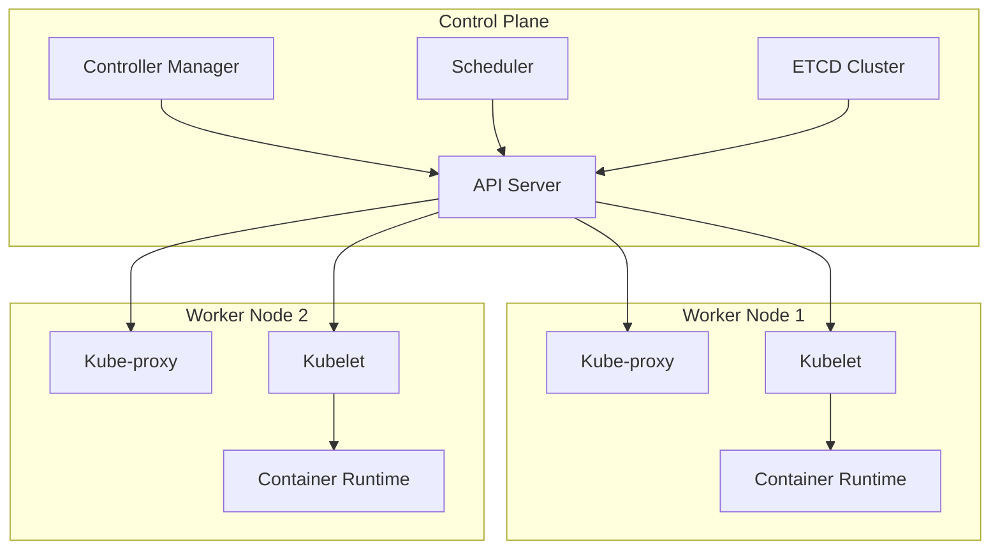

# MACHINELEARNING-PIPELINE


## Built with the tools and technologies:


---

# Kubernetes Fundamentals

## What is Kubernetes?

**Kubernetes (K8s)** is a container orchestration platform that automates the deployment, scaling, and management of containerized applications. It acts as the brain that manages containers across multiple machines, ensuring your applications run reliably and efficiently.

## Why Use Kubernetes?

### Key Benefits:
- **Automated Container Management**: Deploy, scale, and manage containers automatically
- **High Availability**: Self-healing capabilities with automatic restarts
- **Scalability**: Scale applications up or down based on demand
- **Resource Optimization**: Efficient use of hardware resources
- **Rolling Updates**: Update applications without downtime
- **Service Discovery**: Automatic networking between services

## Container Runtime vs Kubernetes

### Docker & Container Runtime Interface (CRI)
- **Docker**: Builds and runs individual containers
- **Container Runtime**: Executes containers on a single machine
- **Open Container Runtime (OCI)**: Standard specification for container formats and runtimes

### Kubernetes Orchestration
- **Coordinates Multiple Containers**: Manages containers across many machines
- **CRI Compatibility**: Works with Docker, containerd, CRI-O
- **Cluster Management**: Treats multiple machines as a single compute resource
- **Workload Distribution**: Intelligently places containers based on resources

**Key Difference**: Docker runs containers, Kubernetes orchestrates them at scale.

## Kubernetes Architecture



## Kubernetes Components Explained

### Control Plane Components:

#### **API Server**
- **Function**: Central hub for all cluster communication
- **Role**: Receives and processes all API requests (kubectl commands)
- **Responsibility**: Validates and stores configuration in etcd

#### **ETCD Cluster**
- **Function**: Distributed key-value store
- **Role**: Stores all cluster state and configuration data
- **Responsibility**: Maintains cluster's source of truth

#### **Controller Manager**
- **Function**: Runs various controllers that manage cluster state
- **Role**: Ensures desired state matches actual state
- **Responsibility**: Manages deployments, services, and other resources

#### **Scheduler**
- **Function**: Decides where to place new pods
- **Role**: Analyzes resource requirements and node capacity
- **Responsibility**: Optimal pod placement across worker nodes

### Worker Node Components:

#### **Kubelet**
- **Function**: Node agent that communicates with control plane
- **Role**: Manages pod lifecycle on the node
- **Responsibility**: Starts, stops, and monitors containers

#### **Kube-proxy**
- **Function**: Network proxy managing network rules
- **Role**: Handles service discovery and load balancing
- **Responsibility**: Routes traffic to appropriate pods

#### **Container Runtime**
- **Function**: Runs the actual containers
- **Role**: Pulls images and executes containers
- **Responsibility**: Container lifecycle management (Docker, containerd, CRI-O)

## Kubernetes Kitchen Analogy

| **Kubernetes Concept** | **Kitchen Analogy** | **Explanation** |
|------------------------|---------------------|-----------------|
| **Orchestrator** | A Manager managing the overall kitchen | Kubernetes coordinates all operations |
| **Microservices** | Multiple chefs, each preparing a specific dish | Each service handles one business function |
| **Each service = container** | Every chef assigned to prepare one dish in a separate container | Isolation and specialization |
| **Rolling Updates** | Menu updates while kitchen is running → New dishes served on the go | Zero-downtime deployments |
| **Restart failed containers** | A chef falls sick → Replaced immediately | Self-healing capabilities |
| **Scaling** | Dinner rush? Add more chefs. Fewer customers? Reduce chefs | Automatic scaling based on demand |
| **Declarative approach** | Tell kitchen what to do (serve 10 dishes), not how | Define desired state, K8s handles implementation |
| **Kubernetes Goal** | You say: "Run app on two servers." K8s handles resource allocation | Abstraction from infrastructure complexity |

## Cloud-Native Application Features

Kubernetes enables applications to be:

1. **Deploy**: Consistent deployment across any environment
2. **Zero Downtime**: Rolling updates without service interruption
3. **Update**: Gradual rollouts with automatic rollback capabilities
4. **Scale**: Horizontal and vertical scaling based on metrics
5. **Self-Heal**: Automatic restart of failed components

## Learning Path

### 1. **[K8S Pods](./K8S%20Pods/)**
Learn about the smallest deployable units in Kubernetes

### 2. **[K8S Deployments](./K8S%20Deployments/)**
Understand how to manage application deployments and updates

### 3. **[K8S Services & Ingress](./K8S%20Services%20&%20Ingress/)**
Master networking and external access to applications

### 4. **[K8S ConfigMaps & Secrets](./K8S%20ConfigMaps%20&%20Secrets/)**
Learn configuration and secrets management

### 5. **[K8S TroubleShooting](./K8S%20TroubleShooting/)**
Master debugging and problem resolution techniques

### 6. **[Kind Cluster Demo](./Kind%20Cluster%20Demo/)**
Set up local Kubernetes clusters for development

### 7. **[Kustomize](./Kustomize/)**
Environment-specific configuration management

### 8. **[Helm Charts](./Helm%20Charts/)**
Package management for Kubernetes applications

## Getting Started

```bash
# Check cluster status
kubectl cluster-info

# View nodes
kubectl get nodes

# Create your first pod
kubectl run nginx --image=nginx:latest

# Check pod status
kubectl get pods

# Access pod logs
kubectl logs nginx
```

## Key Takeaways

- **Kubernetes abstracts infrastructure complexity**
- **Declarative configuration over imperative commands**
- **Self-healing and automatic scaling capabilities**
- **Consistent deployment across environments**
- **Microservices architecture enablement**
- **Cloud-native application patterns support**
